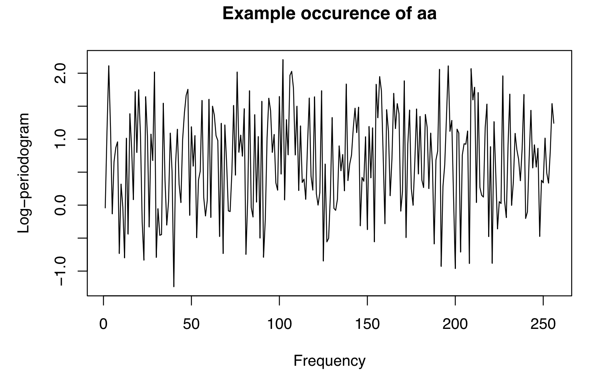

In this project, the performances of each implemented models will be evaluated through cross validation or nested cross validation in the case of parameter tuning. Comparison between this performances will be made upon a confidence interval of the selected metric.

```{r include=FALSE}
library(caret)
library(Metrics)
library(reticulate)
library(klaR)
library(splines)
library(keras)
library(tensorflow)
library(gplots)
library(corrplot)
```

```{r include=FALSE}
reticulate::use_python('/usr/local/Cellar/python@3.8/3.8.6_2/bin/python3.8', required=TRUE)
reticulate::py_config()
```

```{r include=FALSE}
barplot.class <- function(data) {
  barplot(table(data$y), xlab='Class', ylab='Sample', col="#69b3a2")
}
```

```{r include=FALSE}
plot.pca <- function(data.X) {
  pc <- prcomp(x=data.X)$sdev^2 / sum(prcomp(x=data.X)$sdev^2)
  plot(cumsum(pc), ylab='Cumulated explained variance ratio', xlab='Principal component', type='o', col="#69b3a2")
}
```

```{r include=FALSE}
pca <- function(data, comp=ncol(data)-1) {
  pc <- prcomp(x=data[,1:ncol(data)-1], retx=TRUE)
  data.pca <- data.frame(pc$x[,1:comp], y=data$y)
  return(data.pca)
}
```

```{r include=FALSE}
apply.spline <- function(data, df) {
  idx.res <- ncol(data)
  data.ns <- data.frame(as.matrix(data[, -idx.res]) %*% ns(1:(idx.res-1), df=df))
  data.ns$y <- data$y
  data.ns[, -(df+1)] <- scale(data.ns[, -(df+1)])
  return(data.ns)
}
```

```{r include=FALSE}
plot.spline <- function(data, df=4:50) {
  acc.test <- rep(0, length(df))
  acc.train <- rep(0, length(df))
  idx.res <- ncol(data)
  for(i in df) {
    data.ns <- data.frame(as.matrix(data[, -idx.res]) %*% ns(1:(idx.res-1), df=i))
    data.ns$y <- data$y
    acc <- clf.ncv(data=data.ns, method="multinom", nested=FALSE, train=TRUE, tuneGrid=data.frame(decay=0.1))
    acc.test[i-3] <- acc$avg
    acc.train[i-3] <- acc$avgTrain
  }
  plot(c(df[1], df[length(df)]), c(min(acc.test), max(acc.train)), type = "n", xlab="Degrees of freedom", ylab = "Accuracy")
  lines(df, acc.test, col=3)
  lines(df, acc.train, col=2)
  legend(4, 0.768, legend=c("Train", "Test"),
       col=c("red", "green"), lty=1:2, cex=0.8)
}
```

```{r include=FALSE}
plot.size <- function(data, size=1:20) {
  acc.test <- rep(0, length(size))
  for(i in size) {
    acc = holdout(data=data, method='nnet', tuneGrid=data.frame(decay=0.1, size=i))
    acc.test[i] <- acc$avg
  }
  plot(c(size[1],size[length(size)]), c(min(acc.test), max(acc.test)), type = "n", xlab="Size", ylab = "Accuracy")
  lines(size, acc.test, col=3)
}
```

```{r include=FALSE}
plot.ci <- function(results, models) {
  lower <- rep(0, length(models))
  avg <- rep(0, length(models))
  upper <- rep(0, length(models))
  for(i in 1:length(models)) {
    lower[i] <- results[[i]]$lower
    avg[i] <- results[[i]]$avg
    upper[i] <- results[[i]]$upper
  }
  plotCI(x=1:length(models), y=avg, li=lower, ui=upper,  xaxt="n", ylab='Metric', xlab='Models')
  axis(1, at=1:length(models), labels=models)
}
```

```{r include=FALSE}
holdout <- function(data, method, tuneGrid=NULL, seed=10) {
  set.seed(seed)
  idx.test <- sample(1:nrow(data), ceiling(nrow(data)/5))
  train <- data[-idx.test,]
  test <- data[idx.test,]
  model <- caret::train(y~., data=train, method=method, trace=FALSE, MaxNWts=50000, tuneGrid=tuneGrid)
  conf <- acc.conf.int(model, test)
  return(conf)
}
```

```{r include=FALSE}
cv <- function(data, method, formula=y~., K=10, seed=10) {
  set.seed(seed)
  control <- trainControl(method='cv', number=K)
  model <- train(formula, data=data, trControl=control, method=method)
  metric <- model$results$Accuracy
  return(metric)
}
```

```{r include=FALSE}
acc.conf.int <- function(model, data) {
  pred <- predict(model, data[,-ncol(data)])
  if(!is.atomic(pred)) {
    pred <- pred$class
  }
  cm <- confusionMatrix(data$y, pred)
  lower <- as.double(cm$overall['AccuracyLower'])
  upper <- as.double(cm$overall['AccuracyUpper'])
  metric <- as.double(cm$overall['Accuracy'])
  conf <- data.frame(lower=lower, avg=metric, upper=upper)
  return(conf)
}
```

```{r include=FALSE}
rmse.conf.int <- function(model, data) {
  pred <- predict(model, data[,-ncol(data)], interval='confidence')
  err <- rmse(pred, data$y)
  conf <- data.frame(lower=err, avg=err, upper=err)
  return(conf)
}
```

```{r include=FALSE}
ncv <- function(data, method, formula=y~., metric, nested=TRUE, train=FALSE, tuneLength=3, tuneGrid=NULL, outer.K=5, inner.K=5, seed=10) {
  set.seed(seed)
  outer.folds <- createFolds(data$y, k=outer.K)
  conf <- data.frame(lower=double(),avg=double(),upper=double())
  conf.train <- data.frame(lower=double(),avg=double(),upper=double())
  inner.grid <- tuneGrid
  for(fold in 1:outer.K) {
    outer.idx <- outer.folds[[fold]]
    data.inner <- data[-outer.idx,]
    data.validation <- data[outer.idx,]
    if(nested) {
      inner.control <- trainControl(method='cv', number=inner.K)
      inner.model <- caret::train(form=formula, data=data.inner, method=method, trControl=inner.control, tuneLength=tuneLength, tuneGrid=tuneGrid, trace=FALSE, MaxNWts=2000)
      inner.grid <- inner.model$bestTune
    }
    outer.model <- caret::train(form=formula, data=data.inner, method=method, tuneGrid=inner.grid, trace=FALSE, MaxNWts=2000)
    conf[fold,] <- metric(outer.model, data.validation)
    if(train) {
      conf.train[fold,] <- metric(outer.model, data.inner)
    }
  }
  conf <- data.frame(lower=mean(conf$lower), avg=mean(conf$avg), upper=mean(conf$upper))
  if(train) {
    conf.train <- data.frame(lowerTrain=mean(conf.train$lower), avgTrain=mean(conf.train$avg), upperTrain=mean(conf.train$upper))
    conf <- data.frame(conf, conf.train)
  }
  return(conf)
}
```

```{r include=FALSE}
clf.ncv <- function(data, method, formula=y~., nested=TRUE, train=FALSE, tuneLength=3, tuneGrid=NULL, outer.K=5, inner.K=5, seed=10) {
  res <- ncv(data, method, formula=y~., metric=acc.conf.int, nested=nested, train=train, tuneLength=tuneLength, tuneGrid=tuneGrid, outer.K=outer.K, inner.K=inner.K, seed=seed)
  return(res)
}
```

```{r include=FALSE}
reg.ncv <- function(data, method, formula=y~., nested=TRUE, train=FALSE, tuneLength=3, tuneGrid=NULL, outer.K=5, inner.K=5, seed=10) {
  res <- ncv(data, method, formula=y~., metric=rmse.conf.int, nested=nested, train=train, tuneLength=tuneLength, tuneGrid=tuneGrid, outer.K=outer.K, inner.K=inner.K, seed=seed)
  return(res)
}
```


# 1. Phonemes
## 1.1  Dataset

The first data set gathers data which were extracted from the TIMIT database (TIMIT Acoustic- Phonetic Continuous Speech Corpus, NTIS, US Dept of Commerce). These data are widely used for research in speech recognition. The first step here is to conduct an exploratory analysis and, among other thing, an overview of the data set. The phoneme data set contains 2250 samples, each characterized by 256 variables. These samples are split in 5 distinct class as stated in the wording. Here is, in figure 1, the computed log-periodogram, which was rebuilt from the features, of an instance of the data set.

```{r include=FALSE}
ph.data <- read.table('data/phoneme_train.txt')
ph.data$y <- as.factor(ph.data$y)
ph.data.col <- ncol(ph.data)
ph.data.row <- nrow(ph.data)
ph.data[,-ph.data.col] <- scale(ph.data[,-ph.data.col])
ph.data.X <- ph.data[,-ph.data.col]
ph.data.y <- ph.data$y
ph.data.feature <- ncol(ph.data.X)
ph.data.class <- length(unique(ph.data$y))
c(ph.data.row, ph.data.feature, ph.data.class)
```

{width=50%}

```{r include=FALSE}
#plot(1:256, ph.data[1, -257], type = "l", xlab = "Frequency", ylab = "Log-periodogram", main = paste("Example occurence of", ph.data$y[1]))
```

First come an exploratory analysis with the distribution of the samples in the different classes. As we can notice in the chart in figure 2, the data is fairly equally split between the different classes. Thus, we can use the classic accuracy metric and there is no need to come up with a custom or specific metric such as F-score.

{width=50%}

```{r include=FALSE}
#barplot.class(ph.data)
```

Trying to train and fit a model to this data set with its 256 features may lead to overfitting and thus bad performances when classifying unseen samples. To avoid a such bad behavior, we decide to reduce the dimensionnality (the number of feature) and then several method are possible: PCA (Principal Component Analysis), step-wise feature selection or application of splines.  

## 1.2 PCA

Let's begin with the PCA and the first before even trying to reduce the dimensionnality through PCA is to ensure that a PCA will allow us to reduce the number of feature while keeping a maximum of information. So that, we decide to plot the cumulated explained variance ratio. On the figure 3, it is clear that the first components computed by the PCA are holding a good part of the information. Precisely, 10 components are representing more than 80% of the explained inertia. Thus, we decide to perform a 10-components PCA one the data set.

{width=50%}

```{r include=FALSE}
#plot.pca(ph.data.X)
```

```{r include=FALSE}
ph.data.pca <- pca(data=ph.data, comp=10)
```

With our new 10-feature data set, it is now time to try different models such as discriminant analysis models (LDA, QDA, RDA, etc.), tree based models (decision tree, random forest), logistic regression or SVM (Support Vector Machine) models with different kernels (linear, polynomial, radial, etc.).

Of course, all models will not be naively compared. Indeed, we have some remarks concerning the different results we obtained. The first one is about the discriminant analysis. Here the best lambda  and gamma parameter (computed in the inner loop of the nested cross validation) for RDA are respectively 0 and 1, meaning that it is in fact an LDA. RDA being a compromise between LDA and QDA, we can trivially deduce that LDA outperforms here QDA or any other discriminant analysis models. This also means that data are here generally linearly separable. Thus we will focus only on LDA for the discriminant analysis.

From this linear separation of data, we guess that a SVM with a linear kernel will give better performances than one with another kernel. This hypothesis is then validated by the accuracy resulting from several SVM with different kernels. Thus, here again we will focus on the SVM with linear kernel.


```{r include=FALSE}
#ph.lda.pca <- clf.ncv(ph.data.pca, 'lda', nested=FALSE)
#ph.lda.pca # 0.8825829 0.9248613 0.9553685
ph.lda.pca <- data.frame(lower=0.8825829, avg= 0.9248613, upper=0.9553685)
```

```{r include=FALSE}
#ph.qda.pca <- clf.ncv(ph.data.pca, 'qda', nested=FALSE)
#ph.qda.pca # 0.8864498	0.9159989	0.9399152
ph.qda.pca <- data.frame(lower=0.8864498, avg= 0.9159989, upper=0.9399152)
```

```{r include=FALSE}
#ph.rda.pca <- clf.ncv(ph.data.pca, 'rda')
#ph.rda.pca # 0.8825829 0.9248613 0.9553685
```

```{r include=FALSE}
#ph.reglog.pca <- clf.ncv(ph.data.pca, 'multinom')
#ph.reglog.pca # 0.8820133 0.9244089 0.9550516
ph.reglog.pca <- data.frame(lower=0.8820133, avg= 0.9244089, upper=0.9550516)
```

```{r include=FALSE}
#ph.rf.pca <- clf.ncv(ph.data.pca, 'rf')
#ph.rf.pca # 0.8777046 0.9208908 0.9524487
ph.rf.pca <- data.frame(lower=0.8777046, avg= 0.9208908, upper=0.9524487)
```

```{r include=FALSE}
#ph.svm.lin.pca <- clf.ncv(ph.data.pca, 'svm')
#ph.svm.lin.pca # 0.8980572	0.9262181	0.9485898
ph.svm.lin.pca <- data.frame(lower=0.8980572, avg= 0.9262181, upper=0.9485898)
```

## 1.3 Stepwise

The step wise selection of feature is performed forward since this direction will allow to select a small subset of features from the 256-long original one more efficiently. We basically decide here to take the same models than the previous section. Results will not be detailled since we generally obtain worse performances with more features tnah with the PCA. Thus, we are not satisfied with stepwise selection of feature and PCA will be preferred for the moment.

```{r include=FALSE}
#lda.step <- stepclass(y~., data=ph.data, method='lda', direction='forward', output=FALSE, maxvar=50)
#lda.fwd <- clf.ncv(data=ph.data, method='lda', formula=lda.step$formula, nested=FALSE)
#lda.fwd # 0.8776616 0.9209068 0.9525268
lda.fwd <- data.frame(lower=0.8776616, avg= 0.9209068, upper=0.9525268)
```

```{r include=FALSE}
#qda.step <- stepclass(y~., data=ph.data, method='qda', direction='forward', output=FALSE, maxvar=50)
#qda.fwd <- clf.ncv(data=ph.data, method='qdal', formula=qda.step$formula, tuneGrid=data.frame(C=100, sigma=0.01), nested=FALSE)
#qda.fwd # 0.8857012 0.9275497 0.9575438
```

## 1.4 Experiment

This part is inspired from an extract of *Elements of Statistical Learning* and implements multinomial regression in association with natural splines. Certainly in an other way than PCA or step wise selection of features, splines are also reducing the dimensionality of the problem. Moreover, natural splines can bring more flexibility to the trained model which leads to slightly worse training performance but better test performances. This implementation is more detailed as we find its results and performance fairly promising. 

The goal here is to fit a multinomial logitic regression after applying natural splines to the dataset. There is no need to rush here and before trying to do this on the whole dataset, let's try to do it on a subset of the samples with only 2 classes (binomial case). The subset selected is gathering the '*aa*' and '*ao*' phoneme which are the most alike phonemes among the different classes and so the most difficult ones to distinct and to classify. To apply natural splines, we need first to choose a tune a specific parameter: degree of freedom. The tuning is done in a cross validation way by comparing the performance of the logistic regression after splines of different degrees of freedom. On the plot below, we observe that best test accuracy is with a degree of freedom equal to approximately 30. Higher degrees of freedom see the test performances collapse unlike to train performance, which is a sign of overfitting.
The goal here is to fit a multinomial logitic regression after applying natural splines to the data set. There is no need to rush here and before trying to do this on the whole data set, let's try to do it on a subset of the samples with only 2 classes (binomial case). The subset selected is gathering the '*aa*' and '*ao*' phoneme which are the most alike phonemes among the different classes and so the most difficult ones to distinct et classify. To apply natural splines, we need first to choose a tune a specific parameter: degree of freedom. The tuning is done in a cross validation way by comparing the performance of the logistic regression after splines of different degrees of freedom. On the plot in figure 4, we observe that best test accuracy is with a degree of freedom equal to approximately 30. Higher degrees of freedom see the test performances collapse unlike to train performance, which is a sign of over-fitting.

```{r include=FALSE}
a <- ph.data[ph.data$y=='aa' | ph.data$y=='ao',]
a$y <- factor(a$y)
```

{width=50%}

```{r include=FALSE}
#plot.spline(data=a)
```

Through nested cross validation, binomial logistic regression with such natural splines provide an accuracy of around 81% which is 7% better than the same model without spline application.

```{r include=FALSE}
#reglog.a <- ncv(a, method='multinom')
#reglog.a # 0.6354316 0.7382149 0.8246954
```

```{r include=FALSE}
#a.ns <- apply.spline(data=a, df=28)
#reglog.a.ns <- ncv(a.ns, method='multinom')
#reglog.a.ns # 0.7199861 0.8150344 0.8883127
```

It is now time to apply the same process on the whole dataset now that we are confident with this method. Moreover, extending this method to the wholde dataset will provide better results since the number of sample for the training increase signifanctly. Thus, the plot in figure 5 shows once again that 30 is the optimal degree of freedom for the natural splines.

{width=50%}

```{r include=FALSE}
# plot.spline(data=ph.data)
```

Therefore, the logistic regression combined with tuned natural splines gives a performance of 91% which is 2% better than the raw one. More than just this accuracy increase, we can count on the flexibility of our new model to give good results for the test phase.

```{r include=FALSE}
#ph.reglog <- ncv(ph.data, method='multinom')
#ph.reglog # 0.8404709 0.8888721 0.9266394
ph.reglog <- data.frame(lower=0.8404709, avg=0.8888721, upper=0.9266394)
```

```{r include=FALSE}
#ph.data.ns <- apply.spline(data=ph.data, df=28)
#ph.reglog.ns <- ncv(ph.data.ns, method='multinom')
#ph.reglog.ns # 0.8779583	0.9084472	0.933416
ph.reglog.ns <- data.frame(lower=0.8779583, avg=0.9084472, upper=0.933416)
```

```{r include=FALSE}
#control <- trainControl(method='cv', number=5)
#ph.model <- caret::train(y~., data=ph.data.ns, method='multinom', trControl=control, trace=FALSE)
#ph.model
```

```{r include=FALSE}
#save(ph.model, file='env.Rdata')
```

## 1.5 Conclusion

```{r include=FALSE}
results <- list(lda.fwd, ph.lda.pca, ph.qda.pca, ph.svm.lin.pca, ph.rf.pca, ph.reglog.pca, ph.reglog, ph.reglog.ns)
models <- c('LDA F', 'LDA P', 'QDA P', 'SVM-L P', 'RF P', 'RL P', 'RL', 'RL NS')
```

{width=75%}

```{r include=FALSE}
#plot.ci(results, models)
```

Based on the obtained results (see figure 6), we decide to choose the logistic regression model combined with natural splines to solve this problem. Indeed, even if, its provide very slightly lower performances than the ones from PCA, the flexibility brought by the splines will the model to predict unseen data despite differences.

# 2. Letter Recognition
## 2.1 Dataset

The objective is to identify each of a large number of black-and-white rectangular pixel displays as one of the 26 capital letters in the English alphabet. This data set comes from the University of Californa Irvine. The character images were based on 20 different fonts and each letter within these 20 fonts was randomly distorted to produce a file of 20,000 unique stimuli. Each stimulus was converted into 16 primitive numerical attributes (statistical moments and edge counts). A first overview of the data set indicates that it contains 10 000 samples for 16 features. The number of classes is of course 26.

```{r include=FALSE}
lr.data <- read.table('data/letters_train.txt')
lr.data$y <- as.factor(lr.data$Y)
lr.data <- lr.data[,2:ncol(lr.data)]
lr.data.col <- ncol(lr.data)
lr.data.row <- nrow(lr.data)
lr.data[,-lr.data.col] = scale(lr.data[,-lr.data.col])
lr.data.X <- lr.data[,-lr.data.col]
lr.data.y <- lr.data$y
lr.data.feature <- ncol(lr.data.X)
lr.data.class <- length(unique(lr.data$y))
c(lr.data.row, lr.data.feature, lr.data.class)
```

In the same manner than the phoneme data set, it can be interesting to check the distribution of the samples between class. Here again, the samples seem fairly split among the 26 alphabet letter (figure 7) and, thus, accuracy is a relevant metric for this problem.

{width=50%}

```{r include=FALSE}
#barplot.class(lr.data)
```

## 2.2 Models

The letter recognition data set from UCI is very popular and its case was treated in several different articles. Based on the reading of different papers, we decided to test models such as random forest, SVM-based models and neural network-based models since these kinds of models have already prove their worth when it comes to classification problem based on image.

Let's first study the implementation of a simple neural network and its results. A major parameter to tune with neural network is the size of the network. Our first task here is to compare the performance of neural networks with different size on our data. We notice that accuracy is increasing alongside the size of the network, which agree with the general trend that deeper networks provides better performance at the cost of interpretation. However, even with 20 layers, the obtained accuracy is not satisfying. 

```{r include=FALSE}
#lr.nnet <- clf.ncv(data=lr.data, method='nnet', nested=FALSE, tuneGrid=data.frame(decay=0.1, size=20))
#lr.nnet
lr.nnet <- data.frame(lower=0.78579, avg= 0.83201, upper=0.86733)
```

```{r include=FALSE}
#plot.size(lr.data, size=1:20)
```

20 being the limit size of simple neural network, that leads us towards deep learning an deep neural network. We decides to use here a 6-layers network using the *adam* optimizer. In order to avoid the overfitting of our model, we use the dropout method. Each layer has a dropout rate of 0.2 and use ReLu as activation function which is the most advised for deep models (except from the output layer that uses the softmax activation function).

Concerning the number of neurons per hidden layer, since in Deep Learning there are no hard and fast rules to set the number of layers, we decide to try several combinations of number of neurons. We began generating random neurons number between the number of predictors and the number of classes but we had quite bad results. Therefore, then we decided to add a much larger number of neurons on the several layers which lead us to better results.

Then, we also tried to use others method to reduce the complexity of the models such as weight decay method and combining weight decay and dropout but the results were not better.


```{r include=FALSE}
#lr.mlp <- clf.ncv(data=lr.data, method='mlp', nested=FALSE, tuneGrid=data.frame(size=40))
#lr.mlp # 0.8358079	0.8520991	0.8673503
lr.mlp <- data.frame(lower=0.8358079, avg= 0.8520991, upper=0.8673503)
```

```{r include=FALSE}
lr.dl <- data.frame(lower=0.9459273, avg= 0.96, upper=0.9712724)
```


SVM based model are also very interesting in this case where the data set contains original images and their distorted version. This issue has been treated by Chris J.C. Burges and Bernhard Schölkopf in their paper “Improving the Accuracy and Speed of Support Vector Machines”, available [at this link](https://papers.nips.cc/paper/1253-improving-the-accuracy-and-speed-of-support-vector-machines.pdf). According to this paper, SVM are well adapted to this kind of data set thanks to their system of support vector. Indeed, it has been demonstrated that adding samples that undergoes invariance transformations improve the accuracy of SVM over the data set. From out different test, we find that radial kernel is the one with the best results (approximately 94%).

```{r include=FALSE}
#lr.svm.rad <-  clf.ncv(lr.data, 'svmRadial', nested=FALSE, tuneGrid=data.frame(C=1000, sigma=0.01))
#lr.svm.rad # 0.9320336	0.9430999	0.9528433
lr.svm.rad <-  data.frame(lower=0.9320336, avg= 0.9430999, upper=0.9528433)
```

## 2.3 Experiment

As in the first part, we decide to detail the implementation and the reasoning behind a promising model: random forest. In the same manner, a sample subset is extracted from the original data set. It gathers the samples which are labeled as '*A*', '*B*', '*P*' and '*R*' as this letters have alike shape and classify them may be difficult. Before applying a forest, let's study the result of a single tree with **rpart** model. The results are encouraging with an accuracy of around 87% and incite us to increase the number of tree through a random forest (with parameter tuning of course) which provides an accuracy of 98%. These very satisfying results support the extension of the method on the whole data sets. Results are summarized in the table below.

| Data set      | Single tree | Random forest |
|---------------|-------------|---------------|
| ABPR-dataset  | 0.8786906   | 0.9801027     |
| whole dataset | 0.859243    | 0.9489979     |

```{r include=FALSE}
#abpr <- lr.data[lr.data$y=='A' | lr.data$y=='B' | lr.data$y=='P'| lr.data$y=='R',]
#abpr$y <- factor(abpr$y)
```

```{r include=FALSE}
#abpr.rf <- clf.ncv(abpr, 'rf')
#abpr.rf # 0.964673	0.984828	0.9948312
```

```{r include=FALSE}
#lr.rf <- clf.ncv(lr.data, 'rf')
#lr.rf # 0.9384373	0.9489979	0.9582157	
lr.rf <- data.frame(lower=0.9384373, avg=0.9489979, upper=0.9582157)
```

## 2.4 Conclusion

Based on the result in figure 9, we decide to use the deep learning classifier to solve this letter recognition problem. Indeed, it provides very good results and is very voted in in the literature for this famous problem. 

```{r include=FALSE}
results <- list(lr.nnet, lr.mlp, lr.dl, lr.svm.rad, lr.rf)
models <- c('NN', 'MLP', 'DL-keras', 'SVM-rad', 'RF')
```

{width=50%}

```{r include=FALSE }
#plot.ci(results, models)
```

# 3. Bike Rental
## 3.1 Dataset

The bike-sharing rental process is highly correlated to the environmental and seasonal settings. For instance, weather conditions, precipitation, day of week, season, hour of the day, etc., can affect rental behaviors. This dataset is related to the two-year historical log corresponding to year 2011 from Capital Bikeshare system, Washington D.C., USA. A quick overview of the datset confirm that it contains 365 samples which are caracterized by 13 features. However we decide to immediatly remove 3 features from the data set: *instant* and *yr* since they do not bring any information here. 

```{r include=FALSE}
br.data <- read.csv('data/bike_train.csv')
cnt <- br.data$cnt
br.data <- subset(br.data, select=-c(instant, dteday, yr, cnt))
br.data$y <- cnt
br.data$season <- as.factor(br.data$season)
br.data.col <- ncol(br.data)
br.data.row <- nrow(br.data)
br.data.X <- br.data[,-br.data.col]
br.data.y <- br.data$y
br.data.feature <- ncol(br.data.X)
c(br.data.row, br.data.feature)
```

```{r include=FALSE}
br.data$mnth <- as.factor(br.data$mnth)
br.data$holiday <- as.factor(br.data$holiday)
br.data$weekday <- as.factor(br.data$weekday)
br.data$workingday <- as.factor(br.data$workingday)
br.data$weathersit <- as.factor(br.data$weathersit)
```
Some features(holiday,weathersit...) are categorical. So we encode them as factor.
Before going further, we decide to explore the relation between the features. A test chi2 is perfect for this kind of task. According to the correlation matrix in figure10, *temp* and *atemp* features are totally correlated with a *R* coefficient of 1. Thus, *atemp* features is removed as it brings only redundant information.

{width=50%}

Some variables such as dteday and weekday are cyclic in their semantic. To handle this specific case and represent this cycle in the data, we decide to perform a trigonometric transformation involving cosinus and sinus function on these features.

## 3.2 Models

This problem is a regression problem and so here we choose to compare the performance of the different models to be tested with the RMSE (Root Mean Square Error).We therefore use the `K-fold cross-validation` method. It allows us to use all the data for training, so that we can compare the different models afterwards. We choose to repeat the cross-validation 3 times with 10 blocks to reduce the variance of its error. There are hyperparameters to define in some models, we use the `cross-validation` nested to determine these optimal parameters. We try here a vast panel of regression models such as linear regression and its derivations, tree-based models, SVM with different kernels,Lasso,Ridge,Elasticnet,GAM, and KNN (K-Nearest Neighbors).

We start with a linear regression on the extracted characteristics PCA.The RMSE mean obtained by cross validation for is 713.1381.We perform K-nearest neighbor regression. We use a nested cross-validation to select the optimal hyperparameter K (number of neighbors), over an interval of 1 to 100. We find the optimal hyperparameter is 3.The RMSE obtained is 751.1739.
We perform a decision tree. The image in figure 11 is the model we got.The average RMSE obtained is 688.3022.

{width=50%}

Based on the decision tree, we perform a bagging aggregation regression. This is one of the aggregation techniques for reducing errors. An RMSE average of 643.8826 is observed.Next, we perform another aggregation technique, Random Forests. The number of predictors tested at each optimal mtry division is estimated by nested cross-validation (optimal mtry = 13). The average RMSE obtained is 530.8038.We perform a GAM (generalized additive model). The average RMSE obtained is 595.588.
Then,we focus on penalized regression models. We apply the Ridge, Lasso and Elasticnet models.We adjust the hyperparameters by nested cross-validation as before.
For ridge regularization, we adjust the `lamba` regularization hyperparameter in a set of values ranging from 0.001 to 1000 The model with the best root mean square deviation (RMSE = 596.9573) corresponds to a lambda of 93.26033.Likewise, the best model by Lasso regularization (RMSE = 589.6848) corresponds to a lambda of 4.328761.
Elasticnet regularized regression is a combination of the first two. the model with the best RMSE (590.3776) corresponds to a lambda of 13.97262 and an alpha of 0.1.
Finally,We perform the SVM model with different kernels: linear kernel, polynomial kernel, and radial basis kernel (Gaussian). The optimal C parameter is estimated by nested cross-validation. (Optimal C = 1 for the different kernels) And the RMSEs obtained are 558.2613, 549.8506 and 558.2613.

## 3.5 Conclusion


Figure 12 is presenting the result of all our models, comparing the tests on the different methods, we find that the best performing model is the random forest model with optimal mtry = 14 and ntree = 434.

```{r include=FALSE}
#br.rf <- reg.ncv(data=br.data, method='rf')
#br.rf # 532.9797	532.9797	532.9797
```

```{r include=FALSE}
#br.svm.lin <- reg.ncv(data=br.data, method='svmLinear', tuneGrid=data.frame(C=C.values))
#br.svm.lin # 599.8556	599.8556	599.8556
```

```{r include=FALSE}
#br.svm.poly <- reg.ncv(data=br.data, method='svmPoly')
#br.svm.poly # 622.8671	622.8671	622.8671
```

```{r include=FALSE}
#br.svm.rad <- reg.ncv(data=br.data, method='svmRadial')
#br.svm.rad # 601.9096	601.9096	601.9096
```

```{r include=FALSE}
#br.svm.lm <- reg.ncv(data=br.data, method='glmnet')
#br.svm.lm # 604.2966	604.2966	604.2966
```

```{r include=FALSE}
#br.svm.gau <- reg.ncv(data=br.data, method='gaussprRadial')
#br.svm.gau # 543.2032	543.2032	543.2032
```
